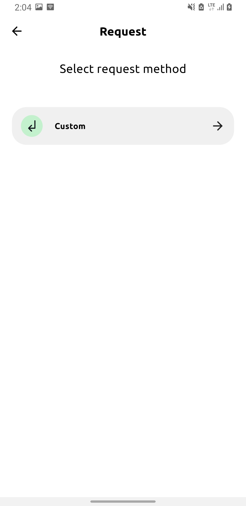
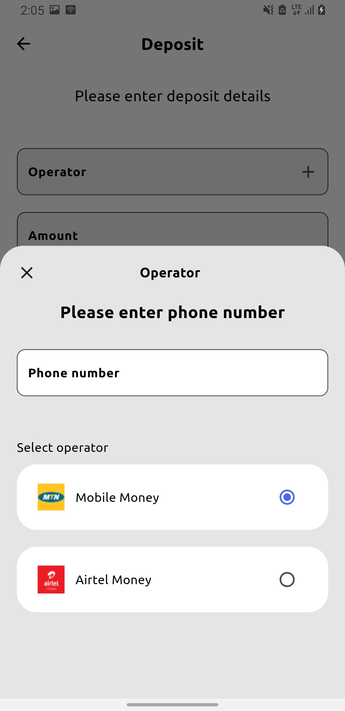

# Zai Finance App

Zai is a fintech application where you deposit, send, request, save and budget for money. For use in financial transactions

## :sparkles: App Features

- Authentication
- Send money to user
- request money from user
- deposit money
- create saving goals
- profile management
- view past transactions
- analyse income and expenditure overtime
- pay up for payment requests

## :iphone: Screens

Login | Home screen | Profile Screen |
:------------:|:-----------:|:--------------:|
 |  | 
Search user | Send Money | Request Money |
 |  | 
Deposit Money | Transactions | Requests |
 |  | 
Requests Details | Analyse Expenditure | Analyse Income |
 |  | 
Saving Goals | Goal Details | Create Goal |
 |  | 

## 🚀 Technologies
- Flutter 3.19.3
- Dart 3.3.1
- FlutterWave Api
- Firebase
